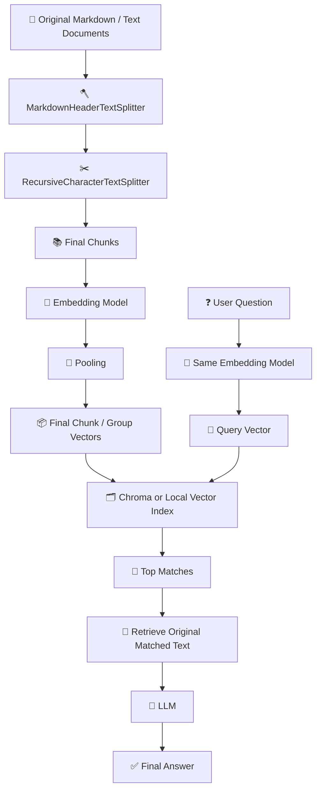

# 🚀 RAG Workflow README

> A clean, integrated overview of the current **Retrieval-Augmented Generation (RAG)** pipeline, from Markdown chunking to embedding, pooling, querying, retrieval, and final LLM answering.

---

# 📌 Overview

This project implements a document-grounded **RAG workflow** using:

- 📄 Markdown/text documents
- 🪓 Markdown-aware chunking
- ✂️ Recursive splitting
- 🧠 Embedding models
- 🧩 Pooling
- 📦 Vector-based retrieval
- 🤖 LLM answering

The goal is to:

1. split source documents into meaningful chunks  
2. convert chunks into embedding vectors  
3. retrieve the best-matching chunks for a user query  
4. send the retrieved text into an LLM for final answering  

---

# 🧠 What is RAG?

**RAG = Retrieval-Augmented Generation**

It means:

```text
Question
→ retrieve relevant document chunks
→ give retrieved chunks to LLM
→ LLM writes the answer
```

So RAG combines:

- 🔍 **retrieval/search**
- 🤖 **generation**

---

# 🔄 End-to-End Workflow

## Figure 1. End-to-end RAG workflow



---

# 🧱 Pipeline Stages

| Step | Stage | What it does | Output |
|---|---|---|---|
| 1 | 📄 Input documents | Load markdown/text files | Raw documents |
| 2 | 🪓 Markdown split | Split by headings like `#`, `##`, `###` | Structured chunks |
| 3 | ✂️ Recursive split | Break oversized chunks into smaller pieces | Final text chunks |
| 4 | 🧠 Embedding | Convert each chunk into a numeric vector | One vector per chunk |
| 5 | 🧩 Pooling | Merge token-level outputs into one final vector | Final chunk embedding |
| 6 | 📦 Optional pooled grouping | Combine multiple chunk vectors into broader section-level vectors | Pooled vectors |
| 7 | 🔍 Querying | Embed the user question and compare against stored vectors | Top matched items |
| 8 | 🤖 Generation | Send retrieved text + question to the LLM | Final answer |

---

# ✂️ Chunking Workflow

## 1. MarkdownHeaderTextSplitter
Used first to split the Markdown document by structure:

- `#`
- `##`
- `###`

This keeps section meaning intact.

## 2. RecursiveCharacterTextSplitter
Used after Markdown splitting to further split large sections that exceed the target size.

### Why recursive splitting is needed
- keep chunks small enough for embedding
- improve retrieval precision
- avoid huge multi-topic chunks

### Important meaning
**Recursive splitting is not AI.**  
It is a rule-based text splitter that keeps breaking oversized sections into smaller parts.

---

# 📚 Final Chunk Output

After Markdown splitting + recursive splitting, the document becomes a set of **final chunks**.

Example:

```text
Original document
→ 10 markdown sections
→ 81 recursive chunks
```

These final chunks are the actual units used for embedding.

---

# 🧠 Embedding Step

## What embedding does

Each chunk is passed into an **embedding model**.

Example:

```text
chunk text
→ embedding model
→ vector
```

So:

- **1 chunk = 1 embedding vector**

If you have 81 chunks, you usually get:

- **81 vectors**

---

# 🧩 Pooling Step

## Pooling inside the embedding model
This is required.

```text
token-level outputs
→ pooling
→ one final vector per chunk
```

Pooling converts many token-level hidden vectors into **one final embedding vector**.

## Common pooling types

| Pooling type | Meaning |
|---|---|
| mean pooling | Average all token vectors |
| max pooling | Keep max values |
| CLS pooling | Use special token representation |
| attention pooling | Weighted combination |

---

# 🧩 Optional Group Pooling

There is also another kind of pooling in this workflow:

```text
81 chunk vectors
→ pooled/grouped
→ 10 larger group vectors
```

This is **optional** and is used for broader section-level retrieval.

## Difference between both poolings

| Pooling type | Purpose | Required? |
|---|---|---|
| Inside embedding model | Turn one chunk into one vector | ✅ Yes |
| Across chunk embeddings | Combine many chunk vectors into larger section vectors | ❌ Optional |

---

# 📦 Embedding Output Format

After embedding, the output is usually:

```text
(num_items, embedding_dimension)
```

Example:

```text
(81, 384)
```

Meaning:
- 81 chunks
- each chunk has a 384-dimensional vector

## Conceptual view

| chunk_id | text | vector |
|---|---|---|
| chunk_001 | "RAG combines retrieval..." | `[0.12, -0.44, 0.91, ...]` |
| chunk_002 | "Retriever returns docs..." | `[0.08, 0.31, -0.27, ...]` |

---

# 🗂️ What Chroma Is

**Chroma is not an LLM.**  
It is a **vector database / retrieval system**.

It stores:

- chunk IDs
- original chunk text
- metadata
- embedding vectors

Then it lets you search by semantic similarity.

## Chroma's role in the pipeline

```text
Embedding model = makes vectors
Chroma = stores/searches vectors
LLM = reads retrieved text and answers
```

## What is stored in Chroma

| Field | Meaning |
|---|---|
| `id` | Unique identifier |
| `document` | Original chunk text |
| `embedding` | Final numeric vector |
| `metadata` | Source file, section, counts, etc. |

Example:

```text
chunk_001
text = "RAG combines retrieval and generation..."
embedding = [0.12, -0.44, 0.91, ...]
metadata = {"source": "RAG_chunk_001.md"}
```

---

# 🔍 Querying Step

## What querying means

Querying is:

```text
question
→ same embedding model
→ query vector
→ compare with stored chunk vectors
→ retrieve top matches
```

Important:
- the **same embedding model** should be used for both:
  - stored chunks
  - user question

## Query workflow

```text
User question
→ query embedding
→ query vector
→ compare against stored vectors
→ retrieve top matching chunks/groups
→ load original matched text
→ send that text + question into the LLM
→ LLM answers
```

---

# ❗Important Rule

## Vectors are for searching
## Original text is for reading by the LLM

So:

✅ correct:
```text
question + retrieved original text → LLM
```

❌ wrong:
```text
question + raw vector numbers → LLM
```

---

# 📊 Query Interface Summary

## Figure 2. Query UI summary

| Setting | Value |
|---|---|
| 🧠 Source model from pooled zip | `BAAI/bge-small-en-v1.5` |
| ✅ Use source model from pooled zip | Enabled |
| 🧠 Embedding model | `BAAI/bge-small-en-v1.5` |
| 🏷️ Query prefix | `auto` |
| 🎯 Top matches | `5` |
| ✅ Normalize query embedding | Enabled |
| ✅ Include matched markdown chunks in export zip | Enabled |
| 📦 Extra output formats in export zip | `jsonl`, `npz` |

---

# 📈 Query Run Summary

## Figure 3. Query result summary

| Metric | Value |
|---|---|
| 📦 Pooled candidates | `10` |
| 📄 Markdown chunks | `10` |
| ❓ Query sentence | `how are you today` |
| 🎯 Top matches returned | `5` |
| 🏆 Best score | `0.4795` |
| 📐 Query vector dimension | `384` |
| 🧠 Source model | `BAAI/bge-small-en-v1.5` |

---

# 🥇 Top Retrieval Results

| Rank | Score | pooled_id | group_key | Source file | Member count | Dim | Pooling | Char count | Word count |
|---|---:|---|---|---|---:|---:|---|---:|---:|
| 1 | 0.4795 | `pool_003` | `RAG_chunk_003` | `RAG_chunk_003.md` | 1 | 384 | mean | 236 | 5 |
| 2 | 0.4656 | `pool_008` | `RAG_chunk_008` | `RAG_chunk_008.md` | 13 | 384 | mean | 12423 | 1284 |
| 3 | 0.4563 | `pool_004` | `RAG_chunk_004` | `RAG_chunk_004.md` | 13 | 384 | mean | 11956 | 1211 |
| 4 | 0.4527 | `pool_010` | `RAG_chunk_010` | `RAG_chunk_010.md` | 1 | 384 | mean | 76 | 9 |
| 5 | 0.4521 | `pool_007` | `RAG_chunk_007` | `RAG_chunk_007.md` | 22 | 384 | mean | 23172 | 2357 |

---

# 🎯 Which Retrieval Level to Use?

## Option A: 81 chunk embeddings
Use for:
- finer-grained retrieval
- paragraph-level precision
- best beginner RAG workflow

## Option B: 10 pooled vectors
Use for:
- section-level retrieval
- broader retrieval
- simpler ranking output

### Comparison

| Version | Use case | Pros | Cons |
|---|---|---|---|
| 🔹 81 recursive chunks | Fine-grained RAG | More precise retrieval | More items to search |
| 🔸 10 pooled groups | Section-level retrieval | Simpler, broader retrieval | Less precise |

## Recommendation
For a first practical RAG system, **81 chunk retrieval** is usually better.

---

# 🧪 Scientific Naming of Steps

| Workflow part | Scientific / technical term |
|---|---|
| Splitting by Markdown headings | structure-aware chunking |
| Splitting oversized text | recursive chunking / recursive text splitting |
| Converting text to vectors | embedding |
| Combining token outputs into one vector | pooling |
| Storing searchable vectors | indexing / vector indexing |
| Turning question into vector | query embedding |
| Finding nearest chunks | retrieval / similarity search |
| Final answer writing | generation |

---

# 🧭 Final Practical Workflow

```text
1. Load documents
2. Split by Markdown structure
3. Recursively split oversized text
4. Get final chunks
5. Embed each chunk
6. Pool token outputs into one vector per chunk
7. Optionally pool chunk vectors into bigger groups
8. Store text + vectors + metadata in Chroma
9. User asks a question
10. Embed the question with the same embedding model
11. Query the stored vectors
12. Retrieve best matching original text
13. Send question + retrieved text to LLM
14. Get final answer
```

---

# ✅ One-Line Summary

**This RAG system works by chunking Markdown documents, converting chunks into embedding vectors, retrieving the most relevant text for a user query, and giving that retrieved text to an LLM for final answer generation.**

---

# 🖼️ Publication-Style Figure Captions

## Figure 1
**End-to-end Retrieval-Augmented Generation (RAG) workflow.**  
Original markdown documents were split using Markdown-aware hierarchical chunking followed by recursive size-based splitting. Final text chunks were embedded using a sentence embedding model, pooled into fixed-length vectors, optionally grouped into broader pooled candidates, and indexed for retrieval. User queries were embedded into the same vector space and matched to the stored vectors before the original matched text was passed to a large language model for final answer generation.

## Figure 2
**Graphical querying interface for pooled RAG embeddings.**  
The interface supports upload of pooled embedding archives and markdown chunk archives, model selection, normalization settings, top-k retrieval configuration, and export of JSONL and NPZ retrieval results.

## Figure 3
**Top-ranked pooled retrieval results for a sample user query.**  
The query vector generated from the input sentence was matched against pooled embeddings generated from recursively split markdown chunks using the `BAAI/bge-small-en-v1.5` model with mean pooling. The ranked output includes pooled IDs, source markdown files, group metadata, member counts, and length statistics.

---

# 📬 Suggested Next Step

For the next implementation stage, build:

- `embed_and_store.py` → create embeddings and save into Chroma
- `ask.py` → embed query, retrieve top chunks, send matched text into an LLM
